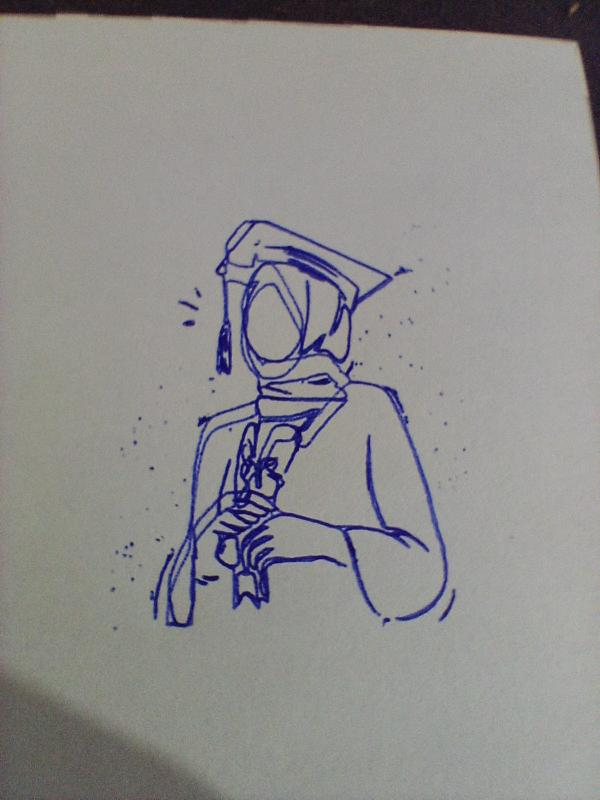

-----

# 2D CNC Plotter - Full Stack Control Application

This project is a full-stack application designed to transform a digital image into a physical drawing using a custom-built 2D CNC plotter. It features a desktop user interface for image selection and a powerful backend pipeline for image processing, vectorization, G-code generation, and hardware communication.

## Demo / Output

**Example Drawing:**

 

## Technology Stack & Architecture

This project is composed of a user-facing frontend and a powerful backend pipeline that handles image processing and hardware communication.

### **Frontend**

The desktop user interface is built using the Flutter framework to create a cross-platform experience.

  * **Framework:** **Flutter**
  * **Language:** **Dart**
  * **Key Packages:**
      * `file_selector`: Used to provide a native file selection dialog for users to pick an image.
      * `material`: Used for the core UI components and styling.
  * The frontend executes a shell command to trigger the Python backend pipeline, bridging the UI with the core logic.

### **Backend**

The backend is a series of Python scripts that form a processing pipeline to convert an image into machine-ready G-code.

  * **Language:** **Python**
  * **Key Libraries:**
      * `Pillow` & `opencv-python`: Used for initial image processing, including opening images, converting formats, and preparing the image for vectorization through binarization.
      * `svgpathtools`: Used to parse the complex vector paths from the intermediate SVG file, translating them into a series of coordinates.
      * `pyserial`: Used for establishing serial communication and streaming the final G-code commands to the Arduino or other hardware controller.
      * `matplotlib`: Used in a separate debugging script to create a visual plot of the G-code path, ensuring correctness before sending it to the physical machine.

### **System Tools & Dependencies**

  * **Potrace:** A powerful open-source command-line utility that is called by the Python backend via a subprocess. It is responsible for the critical step of transforming the processed bitmap image (PBM) into a clean, vector-based SVG file.

## How It Works

1.  The user launches the **Flutter application** and selects an image file (`.png`, `.jpg`).
2.  The Flutter frontend copies the selected image to a temporary directory.
3.  Upon clicking "Send to Arduino", the app executes a shell script that runs the backend Python pipeline.
4.  **`tosvg.py`** script runs, using OpenCV and Pillow to binarize the image and Potrace to convert it to `output.svg`.
5.  **`togcode.py`** script runs, reading the SVG file with `svgpathtools`, scaling and centering the vectors, and converting the paths into G-code commands saved as `output.gcode`.
6.  **`Serial-comm.py`** script runs, opening a connection to the hardware via `pyserial` and streaming each line of `output.gcode` to the CNC machine's controller.

## Installation

To run this project, you need the Flutter environment for the frontend, Python for the backend, and the `potrace` utility.

**1. Install Backend Libraries:**

```bash
pip install matplotlib pyserial svgpathtools opencv-python Pillow
```

**2. Install Potrace:**

  * **macOS (using Homebrew):** `brew install potrace`
  * **Linux (Debian/Ubuntu):** `sudo apt-get install potrace`
  * **Windows:** Download the binaries from the [Potrace website](http://potrace.sourceforge.net/) and ensure it's in your system's PATH.

**3. Run the Frontend:**
Launch the Flutter application. The app's UI will guide you through picking an image and starting the process.

## Challenges & Lessons Learned

  * **Full-Stack Architecture:** A primary challenge was designing a system where a user-friendly frontend (Flutter) could reliably trigger and manage a complex backend (Python pipeline). The solution of using a shell script as a bridge was a practical lesson in inter-process communication and creating a seamless user experience across different technologies.
  * **Image-to-Vector Pipeline:** The process of converting a raster image (pixels) into precise vector commands for a CNC machine was non-trivial. It required chaining multiple specialized tools: OpenCV for image binarization, the external Potrace engine for vectorization, and `svgpathtools` for path interpretation. This taught me the power of building a modular pipeline where each script performs a single, well-defined task.
